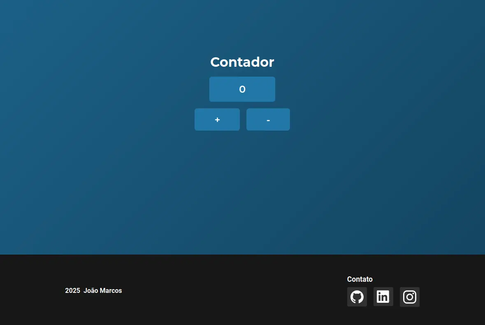

<h1 style="text-align: center">Contador em javascript
    <br>
    <br>
    
</h1>

## Navegação
- [Sobre](#sobre)
- [Pré-requisitos](#pré-requisitos)
- [Como usar](#como-usar)

## Sobre

Este é um projeto simples, utilizando as tecnologias: HTML, CSS e Javascript. O objtivo é desenvolver uma interface web de um contador numerico, para praticar o básico do desenvolvimento front-end web, para futuramente dominar o avançado.

## Pré-requisitos

- Saber o básico de terminal
- Possuir o git

## Como usar 

``` bash
# Clone o repositório
$ git clone https://github.com/joaoMdeASilva/contador-javascript.git

# Entre no reposítorio
$ cd contador-javascript
```

Após isto, execute o arquivo "index.html"  